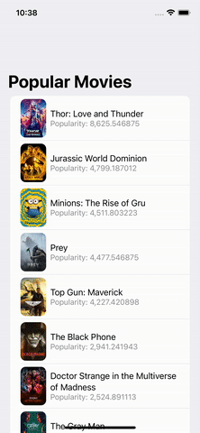

# This app demonstrates Flutter intagration into SwiftUI iOS app

Note: This a demo project has been made to demonstrate the process of integrating Flutter into existing mobile app. 

## Run the project 

1. [Install Flutter](https://docs.flutter.dev/get-started/install) on your machine
2. Run `cd movie_detail_flutter`
3. Run `flutter clean`
4. Run `flutter pub get`
5. Run `cd SimpleMOvieSwiftUIDemoApp`
6. Run `pod install`
7. Run XCode and build the project
8. Happy coding!

## Preview

